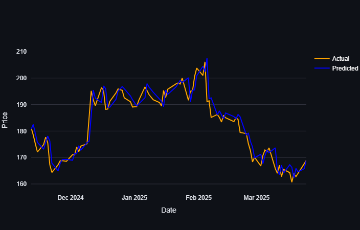
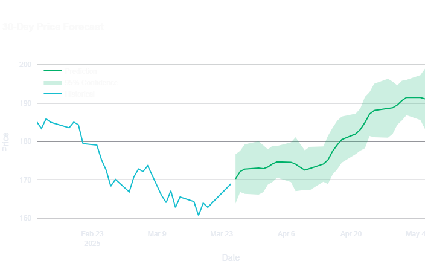

# Stock Price Prediction with LSTM Neural Networks 📈

A sophisticated stock price prediction application using LSTM (Long Short-Term Memory) neural networks, built with TensorFlow and Streamlit.

Try it out [here](https://LSTM-stock-prediction-model-24.streamlit.app/)
## Features 🚀

- **Advanced LSTM Architecture**
  - Multi-scale convolution blocks
  - Bidirectional LSTM layers
  - Multi-head attention mechanism
  - Residual connections
  - Probabilistic outputs with confidence intervals

- **Interactive UI**
  - Real-time stock selection
  - Adjustable prediction timeframe
  - Customizable sequence length
  - Detailed performance metrics
  - Interactive visualizations



## Technical Details 🔧

### Model Architecture
- Input noise injection for robustness
- Detrending layer for stationarity
- Multi-scale feature extraction
- Bidirectional LSTM layers (96 -> 48 units)
- Dual attention mechanism
- Residual dense layers
- Separate mean/variance outputs

### Performance Metrics
- R-squared (Prediction Accuracy)
- RMSE (Root Mean Squared Error)
- Sharpe Ratio (Risk-Adjusted Returns)
- Maximum Drawdown
- MAE (Mean Absolute Error)
- Turnover Correlation


## Installation 🛠️

1. Clone the repository:

```bash
git clone https://github.com/yourusername/stock-prediction-lstm.git
cd stock-prediction-lstm
```

2. Create and activate a virtual environment:

```bash
python -m venv venv
source venv/bin/activate
```

3. Install the required packages:

```bash
pip install -r requirements.txt
```

4. Run the Streamlit app:

```bash
streamlit run app.py
```

## Usage 📱

1. Select a stock symbol from the dropdown menu
2. Adjust the prediction timeframe (1-30 days)
3. Set the sequence length (5-60 days)
4. Click "Predict" to generate forecasts
5. Explore various performance metrics and visualizations

## Key Components 📊

- `app.py`: Main Streamlit application
- `model.py`: LSTM model architecture and training
- `data_processing.py`: Data preprocessing and feature engineering
- `evaluate.py`: Model evaluation and prediction functions

## Performance Optimization 🎯

- Gaussian likelihood loss with trading penalties
- Cosine learning rate decay
- Gradient clipping
- L1/L2 regularization
- Dropout layers
- Batch normalization

## Dependencies 📦

- TensorFlow 2.x
- Streamlit
- Pandas
- NumPy
- Plotly
- yfinance
- scikit-learn




## Contributing 🤝

Contributions are welcome! Please feel free to submit a Pull Request.

## License 📄

This project is licensed under the MIT License - see the [LICENSE](LICENSE) file for details.

## Acknowledgments 🙏

- TensorFlow team for the excellent deep learning framework
- Streamlit team for the amazing web app framework
- The open-source community for various helpful packages

## Disclaimer ⚠️

This tool is for educational purposes only. Stock market predictions are inherently uncertain, and past performance does not guarantee future results. Always do your own research before making investment decisions.